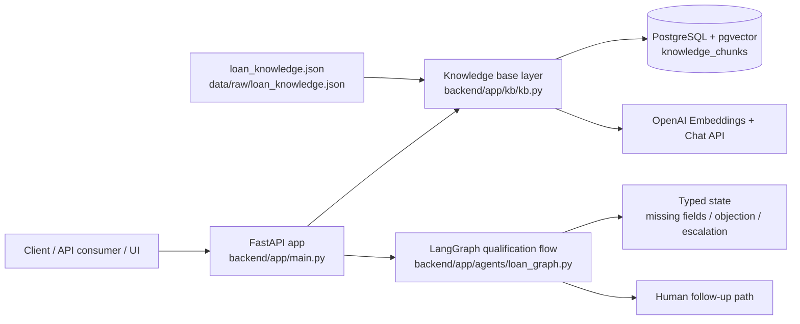

# Loanova — AI-Powered Loan Assistance System

Loanova is a small demonstration system for a loan-assistance workflow built with FastAPI, LangChain, LangGraph, PostgreSQL + pgvector, and OpenAI embeddings. It focuses on safe, grounded retrieval of synthetic loan knowledge and a preliminary qualification flow.

This project is intentionally designed as a demo MVP. It does not approve loans, determine actual eligibility, or issue binding financial offers. It can answer questions using a synthetic knowledge base, collect preliminary data, and route users to human follow-up when needed.

## Why this project exists

The goal is to demonstrate a production-minded AI workflow for a lending assistant while staying within the boundaries of a safe, fictional assessment environment.

Key challenges addressed in the current MVP:

- Grounded retrieval over a loan knowledge base using pgvector
- Safe refusal when a user asks for exact rates, fees, approvals, or eligibility details that are not available in the synthetic dataset
- Citation-aware responses with source metadata
- Structured qualification flow using LangGraph state transitions
- Human escalation and missing-field handling
- Dockerized local development setup with PostgreSQL persistence

## Project objectives

- Provide a safe, grounded answer layer for loan-related questions using structured knowledge retrieval
- Preserve a clear separation between demo guidance and real lending decisions
- Demonstrate LangChain + LangGraph architecture in a realistic AI workflow
- Keep the system easy to run locally and easy to review in an assessment context

## Architecture overview



## Technology stack

- FastAPI: API layer and route handlers
- LangChain + LangChain OpenAI: embeddings and LLM orchestration
- LangGraph: loan qualification workflow with typed state transitions
- PostgreSQL + pgvector: vector storage and retrieval
- Pydantic: request/response validation
- Docker Compose: local service orchestration for PostgreSQL and backend
- pytest: regression testing
- Streamlit: simple browser-based conversation interface for the existing voice-agent API

## Component responsibilities

- `backend/app/main.py`: FastAPI application, lifecycle startup, and routes
- `backend/app/db/db.py`: PostgreSQL connection management and vector extension initialization
- `backend/app/kb/kb.py`: knowledge ingestion, chunking, OpenAI embedding, pgvector retrieval, safe answer generation, and citations
- `backend/app/agents/loan_graph.py`: LangGraph qualification workflow and routing logic
- `backend/app/agents/loan_state.py`: typed state for the loan workflow
- `backend/app/agents/prompts.py`: instructional prompt text for safer assistant behavior
- `data/raw/loan_knowledge.json`: synthetic loan knowledge used by the system
- `docker-compose.yml`: PostgreSQL and backend container orchestration
- `frontend/streamlit_app.py`: browser-based conversation UI for the `/voice/conversation` API
- `frontend/requirements.txt`: frontend-only dependencies for the Streamlit app
- `tests/test_ai_assessment.py`: regression tests covering retrieval, citations, fallbacks, and workflow logic

## Repository structure

```text
.
├── .env.example
├── .gitignore
├── README.md
├── docker-compose.yml
├── backend/
│   ├── Dockerfile
│   ├── requirements.txt
│   └── app/
│       ├── main.py
│       ├── agents/
│       │   ├── loan_graph.py
│       │   ├── loan_state.py
│       │   └── prompts.py
│       ├── db/
│       │   └── db.py
│       └── kb/
│           └── kb.py
├── data/
│   └── raw/
│       └── loan_knowledge.json
├── frontend/
│   ├── Dockerfile
│   ├── requirements.txt
│   └── streamlit_app.py
├── tests/
│   └── test_ai_assessment.py
└── venv/
```

## Prerequisites (macOS)

Before running the project locally, ensure you have:

- macOS with a terminal shell
- Python 3.12+ (the Docker image uses Python 3.12 slim)
- Docker Desktop installed and running
- An OpenAI API key with access to the configured embeddings and chat model
- Git

## Local setup

1. Clone the repository:

```bash
git clone https://github.com/nishantsauravjha/Loanova.git
cd Loanova
```

2. Create a local environment:

```bash
python3 -m venv venv
source venv/bin/activate
```

3. Install Python dependencies:

```bash
pip install -r backend/requirements.txt
```

4. Create a local environment file from the example:

```bash
cp .env.example .env
```

5. Edit `.env` and set your values. Keep the file local-only and do not commit secrets.

Example values:

```env
OPENAI_API_KEY=your_api_key_here
OPENAI_MODEL=gpt-4o-mini
EMBEDDING_MODEL=text-embedding-3-small
DATABASE_URL=postgresql://app:app_password@db:5432/assessment
```

## Docker setup

This project includes Docker Compose support for PostgreSQL, the backend service, and the Streamlit conversation UI.

Start the full stack:

```bash
docker compose up -d --build
```

This starts the PostgreSQL container, the FastAPI backend, and the frontend UI. The database is persisted with a Docker volume named `pgdata`.

To inspect backend logs:

```bash
docker compose logs --tail=60 backend
```

To inspect the frontend logs:

```bash
docker compose logs --tail=60 frontend
```

To check backend health:

```bash
curl http://localhost:8000/health
```

Expected response:

```json
{"status":"ok"}
```

The conversation frontend is available at:

```text
http://localhost:8501
```

### Verified startup flow

```bash
docker compose up -d --build
curl http://localhost:8000/health
curl http://localhost:8501/
```

If the Streamlit UI does not connect to the backend in a browser, make sure the app is running in Docker Compose and that `LOANOVA_API_URL` points to the backend service name from the container (`http://backend:8000`) or the host machine (`http://localhost:8000`) depending on where the app is started. The backend is the source of truth for the voice contract.

## Frontend conversation UI

The Streamlit frontend in [frontend/streamlit_app.py](frontend/streamlit_app.py) connects to the existing `/voice/conversation` API and shows:

- user and assistant messages in a chat layout
- loading state while the backend answer is being generated
- visible citations and evidence when the response includes them
- a reset button for a fresh conversation
- error documentation when the backend is unavailable or rejects the request

This MVP intentionally uses text chat instead of browser microphone features because the repo already uses a small backend-first architecture and a microphone implementation would add browser-specific complexity without improving the core assessment objective.

## API documentation

The current API is implemented in [backend/app/main.py](backend/app/main.py). The major routes are:

### Health check

```http
GET /health
```

Example:

```bash
curl http://localhost:8000/health
```

Response:

```json
{"status":"ok"}
```

### Knowledge ingestion

```http
POST /kb/ingest
```

This loads the synthetic knowledge from `data/raw/loan_knowledge.json` into the vector store and the PostgreSQL `knowledge_chunks` table.

Example:

```bash
curl -X POST http://localhost:8000/kb/ingest
```

Example response:

```json
{"ingested_records": 3, "ingested_chunks": 12}
```

### Knowledge search

```http
POST /kb/search
```

Request body:

```json
{"question":"What is the business loan for?"}
```

Response shape:

```json
{
  "results": [
    {
      "record_id": "loan_001",
      "title": "Business Loan Overview",
      "content": "The demo business loan is intended for small businesses seeking funds for working capital, equipment, or business expansion.",
      "category": "product",
      "source": "demo://loan-product-overview",
      "version": "1.0",
      "pii": false,
      "similarity": 0.87
    }
  ]
}
```

### Knowledge answer

```http
POST /kb/answer
```

Request body:

```json
{"question":"What is the APR?"}
```

Supported safety behavior: if a relevant record says exact rates and fees are unavailable, the system returns a safe fallback instead of inventing numbers.

Example response:

```json
{
  "answer": "The requested loan rates, fees, eligibility, or approvals are unavailable in the demo knowledge base. This system supports synthetic, non-binding guidance only and can collect preliminary details or arrange a human follow-up.\n\nCitations: [loan_004] Interest Rates and Fees (demo://rates-and-fees)",
  "sources": [
    {
      "record_id": "loan_004",
      "title": "Interest Rates and Fees",
      "source": "demo://rates-and-fees",
      "similarity": 0.91,
      "category": "faq"
    }
  ],
  "grounded": false
}
```

### Voice conversation agent

```http
POST /voice/conversation
```

Request body:

```json
{
  "message": "I need a loan for inventory growth.",
  "conversation_state": {}
}
```

Response shape:

```json
{
  "status": "missing_fields",
  "answer": "I need a few preliminary details before I can continue: business type, time in operation, monthly revenue, requested loan amount, and use of funds. This is a synthetic demo workflow and does not imply approval.",
  "missing_fields": ["business_type", "time_in_operation", "monthly_revenue", "requested_amount"],
  "sources": [],
  "grounded": false,
  "escalated": false
}
```

### Qualification workflow

```http
POST /agent/qualification
```

The request shape is defined by the `QualificationRequest` model in [backend/app/agents/loan_graph.py](backend/app/agents/loan_graph.py).

Example request:

```json
{
  "question": "I need a business loan.",
  "business_type": "restaurant",
  "time_in_operation": "2 years",
  "monthly_revenue": "75000",
  "requested_amount": "50000",
  "use_of_funds": "inventory"
}
```

If a field is missing, the workflow returns a structured missing-fields response rather than a guarantee.

Example response:

```json
{
  "status": "missing_fields",
  "missing_fields": ["business_type", "requested_amount"],
  "answer": "I need a few preliminary details before I can continue: business type, requested loan amount. This is a synthetic demo workflow and does not imply approval."
}
```

## Running tests

From the project root:

```bash
source venv/bin/activate
python -m pytest -q
```

The current suite checks the answer flow, citations, unsupported-rate safety behavior, the qualification workflow, and the frontend-to-backend conversation integration.

## Demo workflow

A simple end-to-end flow looks like this:

1. Start the full stack with Docker Compose.
2. Open the Streamlit interface at http://localhost:8501.
3. Ask a simple product or policy question in the chat UI.
4. Call `/kb/ingest` if you want to refresh the synthetic knowledge base.
5. Use the text input to ask about the product, a qualification detail, or a callback request.
6. If the user asks for a callback or escalates, the workflow responds with human follow-up guidance rather than making promises.

Example:

```bash
docker compose up -d --build

curl -X POST http://localhost:8000/kb/search \
  -H 'Content-Type: application/json' \
  -d '{"question":"What is the business loan for?"}'

curl -X POST http://localhost:8000/voice/conversation \
  -H 'Content-Type: application/json' \
  -d '{"message":"I need a business loan for inventory growth.","conversation_state":{}}'
```

## Safety boundaries and known limitations

This is a demonstration system and not a live lending system.

Current limitations and guardrails:

- Synthetic knowledge only; no real underwriting or approval logic
- No actual eligibility determination or binding financial offer generation
- No guarantee of callback scheduling unless a separate operational workflow exists
- Requires a valid OpenAI API key and a running PostgreSQL service with pgvector enabled
- The Streamlit frontend is a scaffold and is not a complete production UI in this repo
- The system intentionally refuses to invent loan rates, fees, approvals, or legal commitments when the knowledge base does not support them

The assistant must be explicit that it is operating in a fictional assessment context and not making real lending decisions.

## Future improvements

- Add a richer frontend for applicant intake and workflow monitoring
- Add persistent admin tools for knowledge ingestion and version tracking
- Add stricter operational logging and audit trails
- Expand the qualification workflow with risk rules and explicit handoff states
- Add integration tests for Dockerized API flows and database-backed retrieval

## Summary

Loanova is a realistic demonstration of an AI-powered loan assistance workflow built around grounded retrieval, safe AI behavior, and structured agent flow. It is designed to help teams review and assess how a responsible loan assistant can provide helpful preliminary guidance without crossing into unauthorized or binding financial decisions.
